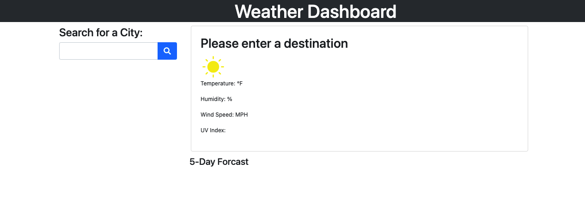
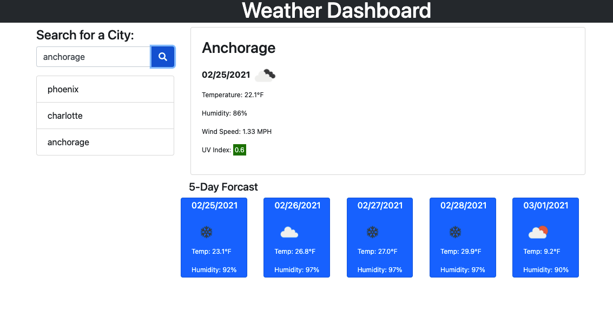

# **weather-dashboard(“weather-dashboard”)**

## Table of Contents

* [Description](#description)
* [Requirements](#requirements)
* [Installation](#installation)
* [Contributing](#contributing)
* [Credits](#credits)

## Description
---
Utilizing the Open Weather Map API, I was able to create a functional weather database. The application will allow you to search a city and receive current weather information, as well as a 5-day forcast. The cities you search will be stored on your page for easy access. 

Deployed Website: 




## Requirements
---
```
GIVEN a weather dashboard with form inputs
WHEN I search for a city
THEN I am presented with current and future conditions for that city and that city is added to the search history
WHEN I view current weather conditions for that city
THEN I am presented with the city name, the date, an icon representation of weather conditions, the temperature, the humidity, the wind speed, and the UV index
WHEN I view the UV index
THEN I am presented with a color that indicates whether the conditions are favorable, moderate, or severe
WHEN I view future weather conditions for that city
THEN I am presented with a 5-day forecast that displays the date, an icon representation of weather conditions, the temperature, and the humidity
WHEN I click on a city in the search history
THEN I am again presented with current and future conditions for that city
```

## Installation
---
No installation needed for this project

See deployed site here: https://haleighspurlock.github.io/weather-dashboard

See repository here: https://github.com/haleighspurlock/weather-dashboard
## Contributing
---

Any and all improvement suggestions are welcome! 

Email: haleighspurlock@gmail.com

## Credits
---
© 2021 Haleigh Spurlock